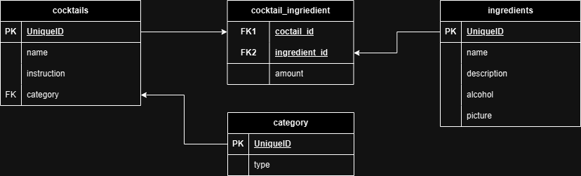

# solvro_rekrutacjaZimowa
Cocktail API

## API Endpoints

### Ingredients

GET /Ingredients: Retrieve all ingredients.
GET /Ingredients/read/:id: Retrieve a specific ingredient by ID.
POST /Ingredients/create: Create a new ingredient.
PUT /Ingredients/update/:id: Update an existing ingredient by ID.
DELETE /Ingredients/delete/:id: Delete an ingredient by ID.

### Cocktails
GET /Cocktails: Retrieve all cocktails.
GET /Cocktails/read/:id: Retrieve a specific cocktail by ID.
POST /Cocktails/create: Create a new cocktail.
PUT /Cocktails/update/:id: Update an existing cocktail by ID.
DELETE /Cocktails/delete/:id: Delete a cocktail by ID.

